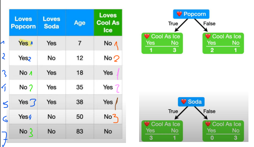
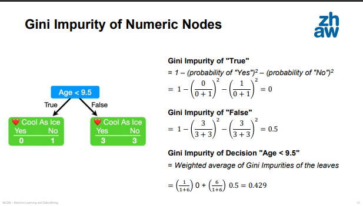
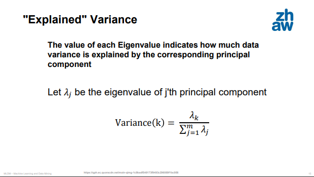

# Decision Trees
For Classification and regression tasks. Hierarchy of if/else questions, leading to a decision.
**Node**: Question or terminal node (leaf) contains answer
**Strengths:**
- Easily be visualized
- Easily understood by non-experts
- Algorithms completely invariant to scaling of the data
- Works well with features on completely different scales or a mix of binary and continous features
**Downside:**
- Even with pre-pruning tend to overfit $\rightarrow$ provide poor generalization performance

## Building decision trees
**Tests**: Questions
**Goal**: Sequence of if/else questions that gets us to the true answer most quickly and most informative
**Binary**: yes/no questions
**Continous**: Is feature i larger than value a? (just an example)
**Root**: Whole dataset
**pure**: Leaf where all data points share the same target value

## Controlling complexity of decision trees
If we continue building tree until all leaves are true then 100 % accuracy on training set $\rightarrow$ Overfitting
### Pre-pruning
Stopping creation of tree early
**Possible Criteria**:
- Limiting maximum depth
- Liminting maximum number of leaves
- Require minimum number of points in a node to keep splitting
### Post-pruning / Pruning
Building tree, but then removing or collapsing nodes, that contain little information

## Inspecting the tree
- Visualization
- Find out which path most of the data actually takes
- Feature importance
- Gini impurity index
#### Feature importance
Numbers between 0 and 1 for each feature. Feature importances always add up to 1
#### Gini impurity index
Gini impurity measures the degree or probability of a particular variable being wrongly classified when it is randomly chosen.
**0** : all elements belong to a certain class or there exists only one class (pure) 
**1**:  elements are randomly distributed across various classes (impure).
**0.5**:  equally distributed elements into some classes.
##### Gini impurity for Yes/No Decisions
$1-$(probability of Yes)$^2 -$(probability of No)$^2$
``` ad-note
title: # Gini impurity for a leaf
$Gini = \sum^n_{i=1}(p_i)^2$

```


``` ad-note
title: # For a leaf
Yes:$\frac{4}{7}$ 

No: $\frac{3}{7}$ 

Yes Popcorn Yes Cool: $\frac{1}{4}$ 

Yes Popcorn No Cool: $\frac{3}{4}$ 

Gini index for True: $1-\frac{3}{4}^2-\frac{1}{4}^2$= $0.375


No Popcorn Yes Cool: $\frac{2}{3}$ 

No Pocorn No Cool: $\frac{1}{3}$ 

Gini index for False: $1-\frac{2}{3}^2-\frac{1}{3}^2$ = $0.444


```

```ad-note
title: # For a decision
Weighted Impurity for a Decision
Weighted average of Gini Impurity of the leaves
$\frac{4}{7}*0.375 + \frac{3}{7}*0.444 = 0.405$
```

##### Gini impurity for Numeric Data
1. Sort numeric data from lowest to highest value
2. Compute average between adjacent values as decision boundaries
3. Compute Gini Impurities for each decision boundary
4. Select boundary with lowest impurity


# Random Forests
One way to address overfitting problem of decision trees. It is a collection of decision trees, each tree might do a good job of predicting, but will likely overfit. 
**Idea**: Build many trees injected with randomness to ensure they are different, all of which work well and overfit in different ways, the reduce the amount of overfitting by averaging their results.
**Ways to randomize:**
- Selecting data points used to build a tree
- **Bootstrapping**=Selecting the features in each split test 
###### Out-of-Bag error
After bootstrapping there will be samples that were not used for this decision tree. We can run each out-of-bag sample through all trees that were built without it.

**Strengths:**
- Basicaly the same ones like decision trees 
- Less overfitting than with decisio tree

**Weakness:**
- Not useful for a compact representation (go deeper than decision trees)
- Time consuming
- Don't tend to perform well on very high dimensional, spare data (such as text)
- Requires more memory
- slower to train and predict

# Corpus Construction
- Sentiment Corpora
- Semi-Automatic Labeling
- Annotation with Crowd Sourcing
- Sentiment Annotation 

## Cohens Kappa
Measure for 2 annotators, how much different annotators agree on data labels.

$\kappa = \frac{n_shared - n_random}{1-n_random}$

$\kappa > 0.7 =$ Good agreement
$\kappa < 0.4 =$ Bad agreement

# Dimensionality Reduction
Transforming data using unsupervised learning.
**Motivation**: 
- Visualization
- Compressing
- Finding representation that is more informative
## Prinicpal Component Analysis (PCA)
Rotates dataset, in such a way that features are statistically uncorrelated. This is then followed by selecting only a subset of the new features, according to how important they are.

### How the Algorithm works
1. Finds direction of maximum variance (direction that contains most informaiton, most correlated)
	1.1 Labels this Component 1
2. Find direction with most information that is orthogonal to the the first direction. (in 2-dimension only one possible direction, in higer dimensions infinitely many orthogonal directions)
**Principle Components**: Directions found
3. Subtract mean from data, so that transformed data is centered around zero
4. Rotates so that first principal component is aligned with the x-axis and the second prinicpal component is aligned with the y-axis. 
	4.1 Correlation matrix: all data is represented as 0 except for diagonal
5. Reduces the data to next lower dimension.
6. Undo rotation
7. Add mean back to the data
8. Kept only the information contained in the first prinipal component

## t-SNE
Aimed at visualization, rarely to generate more than two new generation. Computes new representation of the training data, don't allow transformations of new data $\rightarrow$ Cannot be applied to a test set. Can only transorm the data they were trained for.
**Idea**: Find two-dimensional representation of data that preserves the distances between points as best as possible.
1. Start with random two-dimensional representation for each data point
2. Tries to make points close in the OG feature space closer and points far apart in the OG farther apart
3. Puts more emphasis on points that are close by, rather than preserving distances between far-apart points
4. Tries to preserve information indicating which points are neighbours.
t-SNE has no knowledge of the class labels, it is completely unsupervised, Still clearly separates the classes, based solely on how close points are in the original space.


