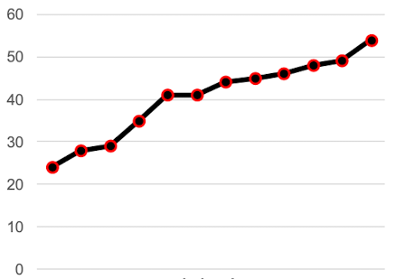

# MLDM

- [1. Introduction](#1-introduction)
  - [1.1. Definitions](#11-definitions)
- [2. Data Processing](#2-data-processing)
  - [2.1. Knowledge Discovery in Databases (KDD)](#21-knowledge-discovery-in-databases-kdd)
  - [2.2. Data Types](#22-data-types)
  - [2.3. Data Classes](#23-data-classes)
  - [2.4. Data Cleaning](#24-data-cleaning)
    - [2.4.1. Equal-Width-Binning](#241-equal-width-binning)
    - [2.4.2. Equal-Depth-Binning](#242-equal-depth-binning)
  - [2.5. Linear Regression](#25-linear-regression)
  - [2.6. Data Normalization](#26-data-normalization)
  - [2.7. Data Sampling](#27-data-sampling)
    - [2.7.1. Non-Probabilistic](#271-non-probabilistic)
    - [2.7.2. Probabilistic](#272-probabilistic)
  - [2.8. Data Partitioning](#28-data-partitioning)
- [3. Evaluation](#3-evaluation)
  - [3.1. Measures](#31-measures)
  - [3.2. Model Evaluation](#32-model-evaluation)
  - [3.3. Clustering](#33-clustering)
- [4. Recommender Systems](#4-recommender-systems)
  - [4.1. Collaborative Filtering](#41-collaborative-filtering)
    - [4.2. User-Based](#42-user-based)
    - [4.3. Item-Based](#43-item-based)
    - [4.4. Content-Based](#44-content-based)
  - [4.5. Context-aware Filtering](#45-context-aware-filtering)
- [5. Association Rules](#5-association-rules)
  - [5.1. Measures](#51-measures)
  - [5.2. Types](#52-types)
  - [5.3. Collecting](#53-collecting)
  - [5.4. Lift measure](#54-lift-measure)
  - [5.5. Summary](#55-summary)
- [6. Regressions](#6-regressions)
  - [6.1. Linear Regression](#61-linear-regression)
    - [6.1.1. Gradient Descent Method](#611-gradient-descent-method)
    - [6.1.2. Mean square Error (MSE)](#612-mean-square-error-mse)
    - [6.1.3. Multivariate Datasets](#613-multivariate-datasets)
  - [6.2. Logistic Regression](#62-logistic-regression)
- [7. Support Vector Machines](#7-support-vector-machines)
  - [7.1. Multi-Dimension](#71-multi-dimension)
  - [7.2. Multi-Class](#72-multi-class)
- [8. Decision Tree / Naive Bayes](#8-decision-tree--naive-bayes)
  - [8.1. Measures](#81-measures)
  - [8.2. Naïve Bayes](#82-naïve-bayes)
- [9. Partitioning Clustering](#9-partitioning-clustering)
  - [9.1. Distance functions](#91-distance-functions)
  - [9.2. K-means clustering](#92-k-means-clustering)
  - [9.3. ISODATA](#93-isodata)
  - [9.4. Measures](#94-measures)
- [10. Hierarchical Density Clustering](#10-hierarchical-density-clustering)
  - [10.1. DBSCAN](#101-dbscan)

# 1. Introduction

##1.1. Definitions

- **Data Mining**
    Process of discovering patterns in large data sets involving methods at the intersection of machine learning, statistics, and database systems.
- **Machine Learning**
    Scientific study of algorithms and statistical models that computer systems use to perform a specific task without using explicit instructions, relying on patterns and inference instead.
- **Deep Learning**
    Class of machine learning algorithms that use multiple layers to progressively extract higher-level features from the raw input.
- **Reinforcement Learning**
    Machine learning training method based on rewarding desired behaviors and/or punishing undesired ones. Able to perceive and interpret its environment, take actions and learn through trial and error.

|                 | Supervised                                                                                                                                                                                                                                        | Unsupervised                                                                                                                                   |
| --------------- | ------------------------------------------------------------------------------------------------------------------------------------------------------------------------------------------------------------------------------------------------- | ---------------------------------------------------------------------------------------------------------------------------------------------- |
| **Description** | The algorithm is presented with inputs and associated labels indicating the class of the observation. The algorithm attempts to learn the rule that maps inputs to each class. New data is classified based on the rule learned by the algorithm. | The algorithm is presented only with the inputs. The algorithm attempts to classify things based on similarity or dissimilarity to each other. |
| **Data**        | Is labeled with a class or value                                                                                                                                                                                                                  | Is unlabeled                                                                                                                                   |
| **Goal**        | Predict class or value                                                                                                                                                                                                                            | Determine data patterns / groupings                                                                                                            |
| **Algorithms**  | SVM, Linear Regression, Decision Trees                                                                                                                                                                                                            | K-Means, DBScan, Hierarchical                                                                                                                  |

# 2. Data Processing

## 2.1. Knowledge Discovery in Databases (KDD)

KDD is the process of (semi-) automatic extraction of knowledge from databases which is valid, previously unknown, and potentially useful.

Consists of different steps:

1. **Focussing** Selects target data from the source
2. **Preprocessing** Fill in missing data, clean data
3. **Transformation** Transform any columns or create new ones based on existing
4. **Data mining** Find patterns
5. **Interpretation** Gain knowledge from the results

KDD is an interactive and iterative process meaning that multiple steps have to be retaken and reevaluated at any given time.

## 2.2. Data Types

We identity the following data types.

- **Nominal**
  - No numerical significance (no order)
  - Scale is called "labels"
  - Examples
    - Gender
    - Hair color
    - Race
- **Ordinal**
  - Ordered
  - No distance between the different categories
  - Examples
    - Military rank
    - Movie rating
    - Difficulty level
- **Discrete numerical**
  - 0 to infinity
  - Example
	- Number of persons in a room
	- Number of classes taken this semester
-Continous numerical**
  - All possible values cannot be counted
  - Example
    - Time
    - Temperature
    - Weights
    - Height

### 2.3. Data Classes

- Multidimensional data
- One-dimensional data
- Network data
- Hierarchical data
- Time-series data
- Geographic data

## 2.4. Data Cleaning

Identifying problems is relatively easy but fixing them can be exceptionally hard.

The following Problems can occur:

- **(near) duplicates**
  - Compare the attributes
  - Compare the content of the attributes (e.g. calculate levensthein distance)
- **missing values**
  - Ignore
  - Manually inserting
  - Using a global constant (e.g. -1)
  - Use attribute mean
  - Use the most probable value
- **noisy data**
  - Eliminate outliner
  - Binning
  - Regression
  - Clustering

Pros and cons of the method for filling in missing values:

### 2.4.1. Equal-Width-Binning

Equal-Width-Binning works by dividing the range of data into `n` intervals of equal size. This is a very simple method but outliers may dominate the result
The width is calculated as:

$$w=\frac{max-min}{N}$$

*Example:*

- Values: $24, 28, 29, 35, 41, 41, 44, 45, 46, 48, 49, 54$
- $N = 3$ (user-defined)
- $w=\frac{max-min}{N}=\frac{54-24}{3}=10$

| Data                       | Original                       | 3-bin Averages                |
| -------------------------- | ------------------------------ | ----------------------------- |
|  |  |  |

### 2.4.2. Equal-Depth-Binning

Equal-Depth-Binning divides the range into `n` intervals each contains approximately the same number of records. This way skewed data is also handled well.

*Example:*

- Values: $24, 28, 29, 35, 41, 41, 44, 45, 46, 48, 49, 54$
- $N = 3$

| Data                       | Original                       | 3-bin Averages                |
| -------------------------- | ------------------------------ | ----------------------------- |
|  |  |  |

To further improve handling of outliers in data we can apply two different smoothing methods:

- **Mean**: Replace each value by the mean value of the bin
  - `[29, 29, 29, 29], [43, 43, 43, 43], [49, 49, 49, 49]`
- **Boundaries**: Replace each value by closest boundary value
  - `[24, 24, 24, 35], [41, 41, 45, 45], [46, 46, 46, 54]`
### 2.4.3. Feature Scaling
**Problem:** Features have different values (weights between 70-100kg vs height between 1.6-2-0m)
**Goal:** Make all features (Columns of X) approximately of equal size typically around 0

##### Min-Max Normalization
$x'=\frac{x-MIN(X)}{MAX(X)-MIN(X)}$
**Transformation:** Values between 0-1

##### Standardization
$x'=\frac{x-\mu(X)}{\delta}$
$\mu =$ mean of values of feature X
$\delta=$ standard deviation of feature X
**Transformation**: Distribution centered at 0 with standard deviation of 1.

##### Logarithm
**Situation:** Range of features values is large, many close to zero but all >0.
Then apply natural log:

# 3 Clustering
**Goal:** Find subgroups similar to each other.
$X =$ {$x^{1},x^{2},...x^{m}$}  where $x^{i}$ consists of n features $x^{i} =$ {$x^{i}_1,x^{i}_2,...x^{i}_n$} 
**Defintition:** Samples in Cluster have a small distance D.
Dealing with unlabeled Data.

There are four typical cluster models:

- **Connectivity models**: Based on distance
- **Centroid model**s: Uses k-means algorithm to represent each cluster by a single mean vector
- **Distribution models**: Uses statistical distributions
- **Density models**: Defines cluster as connected dense regions in the data space
## 3.1 K-Means
Aims to partition $n$ observations into $k$ clusters in which each observation belongs to the cluster with the nearest mean.

- **Input**:
  - $D={p_1, ..., p_n}$ Points
  - $k$ Number of clusters
- **Output**
  - $C={c_1, ..., c_k}$ Cluster centroids
  - $D\rightarrow {1, ..., k}$ Cluster membership

Method ([Clustering in Machine Learning](https://developers.google.com/machine-learning/clustering/algorithm/run-algorithm))

1. Choose $k$ objects from $D$ as the initial cluster centers
2. (Re)assign each object to the cluster to which the object is the most similar based on the mean value of the objects in the cluster
3. Recalculate the centroid by taking the average of all points in the cluster.
4. Repeat from step 2 until assignments don't change anymore

| K-means at initialization | Initial clusters            | Recomputation of centroids  | Cluster after reassignment  |
| ------------------------- | --------------------------- | --------------------------- | --------------------------- |
|  |  |  |  |

**Advantages**

- Relatively efficient with $O(Lkn)$
  - $L$number of iterations
  - $k$ number of clusters
  - $n$ number oc data points
- Simple implementation

**Disadvantages**

- Need to specify number of clusters $k$
- Unable to handle noisy data and outliers
- Cannot detect clusters with non-convex shapes
- Applicable only when mean is defined
- Often terminates at a local optimum
**Stop-Criterion:** 
- Centroids do not change anymore
- Centroids change only very little from one iteration to the next
- few data are re-assigned to a different centroid
- fixed number of iterations
- certain time for the entire computation
**Runtime-complexity:** NP-Hard - $\mathcal{O}(Lknm)$ with L = iterations, K = random points, m= data points, n= features

## 3.2 DBSCAN
Hierarchical clustering builds models based on distance connectivity and merging of clusters with minimum distance. A typical clustering anaylsis approach via partitioning data set sequentially.

Initially each point is in its own cluster. Then these atomic cluster are merged into larger and larger clusters. A dendrogram is a good way to visualize this. On the bottom each point is individual and one by one they are connected.

**Method**

1. Form initial clusters consiting of a single object and compute the distance between each pair of clusters
2. Merge the two clusters having minimum distance
3. Calculate the distance between the new cluster and all other clusters
4. If there is only one cluster containing all objects $\rightarrow$ Stop, otherwise go to step 2

There are no input parameters needed. And different methods can be applied like: single, complete, avarage, median and centroid linkage.

- **Single linkage**: Shortest distance single link between an element in one cluster and an element in the other.
- **Complete Linkage**: Largest distance between an element in one cluster complete link and an element in the other.
- **Average Linkage**: Avg distance between all elements in one cluster and elements in the other.

Density-Based Spatial Clustering of Applications with Noise (DBSCAN) defines clusters as connected dense regions in the data space. There is no need to specify the number of clusters.

- $min_{points}$ the minimum number of points clustered together for a region to be considered dense
- $\epsilon$ a distance measure that will be used to locate the points in the neighborhood of any point
  
A cluster is defined with a core point and multiple border points. The core is a point with at least $min_{points}$ points within distance $\epsilon$ form itself and the border points have at least one core point at a distance < $\epsilon$. Noise points are points that are neither core points or border points.

**Method**

1. It starts with a random unvisited point. All points within a distance $\epsilon$ classify as neighborhood points
2. It needs a minimum number of points $min_{points}$ within the neighborhood to start the clustering process. Otherwise the point gets labeled as Noise.
3. All points within the distance $\epsilon$ become part of the same cluster. Repeat the procedure for all the new points added to the cluster group. Continue till it visits and labels each point within the $\epsilon$ neighborhood of the cluster.
4. On Completion of the process, it starts again with a new unvisited point thereby leading to the discovery of more cluster or noise. At the end of the process each point is marked.

**Advantages**

- No need to specify the number of clusters
- Able to find arbitrarily shaped clusters
- Able to detect noise

**Disadvantages**

- Cannot cluster data sets well with large differences in densities
For clustering methods the **Silhouette** coefficient is very important it indicates the following:
**Runtime:** $O(m^2)$ can be reduced to $O(m*\log{m})$
## 3.3 Clustering evaluation
**Potential function:** Measures the squared distance between each datapoint and its closest centroid.
$Let$ C ={$c_1,...c_k$} a set of k centroids then:
$\phi(C,X)=\sum^{m}_{i=1}{min_{c\in{C}}d(x^i,c)^2}$

##### Elbow-Method
1. run k-means with different values of k
2. Plot value of the potential function $\phi$ for each value of k.
3. Value of k point where slope of curve significantly decreases (where elbow would be) is a good choice 

##### Dendogramm
- **Dendrogram**: Visual inspection of distance and balancing in hierarchical clustering.
- **Purity**: A simple & transparent measure of correctness of clustering
- **Rand index**: compares two clustering (e.g. own scheme with random partition)
- **Precision**
- **Recall**
- **Misclassification rate**
  - $N$ number of samples
  - $C$ number of true clusters
  - $e_j$ number of wrongly assigned samples of true cluster $j$

  $$MR=\frac{1}{N}\sum_{j=1}^{c}e_j$$
By using a dendrogram the distance between clusters can be visualized.

##### Silhouette Coefficient
 datapoint $i \in C_I$:
 $a(i)=\frac{1}{C_I - 1}\sum_j\in C_{I,i\neq j}{d(i,j)}$ = Mean distance i and other datapoints in cluster

For each datapoint $i \in C_I$:
$b(i) = min_{J\neq I}\frac{1}{C_J}\sum_{j\in C_J}{d(i,j)}$ = Smallest distance of i to all points in any other cluster of which i is not a member

Silhouette value of point i:
$s(i)= \frac{b(i)-a(i)}{max(a(i),b(i))},if |C_I|>1$

- **Silhouette Coefficient**: Measures how dense and well-separated the clusters are. It can be calculated of reach point individual and be visualized in a plot.
  - $s > 0$ Cluster is very dense and nicely separated
  - $s = 0$ Clusters are overlapping
  - $s < 0$ Cluster is probably incorrect
  

- $s >= 1$ Sample is far away from the neighboring clusters
-  $s < 1$ Sample is close to the decision boundary
- $s \approx 0$ Sample is at the decision boundary, which means that the s ample might be assigned to the wrong cluster.

# 4 Linear Regression

Fit a form of the formula: $y = a + b*x$ while minimizing the square of errors. 
**Goal:** Result is an intercept and coefficient. Intercept gives base value for a prediction modified by adding product of the coefficient and the input.

Given a set of m training samples
($x^{(i)}_{=input variable/feature},y^{(i)}_{=output value}$) we define **Hypothesis** h as linear function with two parameters $\theta_0$ and $\theta_1:$
$h_\theta(x)= \theta_0 + \theta_1*x$

**Cost function**:
$J(\theta_0,\theta_1)=\frac{1}{2m}\sum^m_{i=1}{(h_\theta(x^{(i)})-y^{(i)})^2}$
Also known as Squared Error function or Mean Squared Error (MSE) Loss. 

**Goal:** Find local Minimum of $J(\theta_0,\theta_1)$
- Compute partial derivatives of $J(\theta_0,\theta_1)$ in direction of $\theta_0$ and $\theta_1$
- Set partial derivatives to 0, use calculus to solve system

A linear function is defined as $y = a + b*x$
Where $b$ is the slope of the function. It can be calculated with which is also the explicit solution of finding the local minimum:

$\theta_1=\frac{\sum_{i=1}^{n}(x_i-\overline{x_{mean}})(y_i-\overline{y})}{\sum_{i=1}^{n}(x_i-\overline{x_{mean}})^2}$

Where $\overline{{x_{mean}}}$ is the mean value of $x$ and $\overline{y}$ is the mean value of $y$. Once $\theta_1$ is known $\theta_0$ can be found by: $\theta_0=\overline{y}-\theta_1*\overline{x_{mean}}$

**Pearson Correlation Coeffecient:**
$\rho(A,B)=\frac{\sum_{i=1}^{m}(a_i-\overline{a})(b_i-\overline{b})}{\sqrt{\sum_{i=1}^{m}(a_i-\overline{a})^2 *\sum_{i=1}^m{(b^{(i)}-\overline{b})^2}}} = \rho(X,Y)*\frac{s_y}{s_x}$

$\rho$ is always between -1 and +1
- $\rho =$ -1 $\rightarrow$ perfect negative linear relationship
- $\rho =$ +1 $\rightarrow$ perfect positive linear relationship
- $\rho =$ 0 $\rightarrow$ no linear relationship between A and B

## 4.1 Basic Assumptions of Linear Regression
1. Linearity
2. Independence
3. Normality
4. Homoscedasticity (Equality of Variance)
### 4.1.1 The residual
**Residual:** for samle i $\rightarrow$ $e^{(i)}=y^{(i)}-h_{\theta}(x^{(i)})$
Residualplot (especially neccessary for higher dimensional funtions):

### 4.1.2 Linearity
Input and output values have a linear relationship.

### 4.1.3 Independence
Outcome of one sample does not affect the others

### 4.1.4 Normality
Errors are normally distributed: Larger deviations from mean should be less likely

### 4.1.5 Equality of Variance
Error distribution should be the same for all input values.

## 4.2 Mulitvariate Linear Regression

Linear regression also works on data sets with more than two features.

**Hypothesis** $h_\theta(x)= \theta_0x_0+ \theta_1x_1+...+\theta_nx_n = \theta^Tx$ with $x_0 = 1$
**Cost function**: $J(\theta_0,\theta_1,...,\theta_n)=\frac{1}{2m}\sum^m_{i=1}{(h_\theta(x^{(i)})-y^{(i)})^2}$

**Example**:
| person | scores=y| IQ=$x_1$ | Study Hours=$x_2$ |
| ------ | ----- | --- | ----------- |
| 1      | 100   | 110 | 40          |
| 2      | 90    | 120 | 30          |
| 3      | 80    | 100 | 20          |
| 4      | 70    | 90  | 0           |
| 5      | 60    | 80  | 10          |
$$\hat{y}=\theta_0+\theta_1*x_1+\theta_2*x_2$$

Where:

- $\hat y$ is the predicted test score
- $\theta_0, \theta_1, \theta_2$ are regression coefficients ($\theta$)
- $x_1$ is the IQ score
- $x_2$ is the number of hours that the person studied

To find the regression coefficients $b$ we first have to solve the following equation:
$\theta=(X^TX)^{-1}X^TY$

## 4.3 Gradient Descent Algorithm

In the gradient descent methods it is all about moving the linear function. There are four cases of moving a line:

- rotate counter-clockwise and translate up $\rightarrow$ increase slope and increase the y-intercept
- rotate clockwise and translate up $\rightarrow$ decrease the slope and increase the y-intercept
- rotate counter-clockwise and translate down $\rightarrow$ increase the slope and decrease the y-intercept
- rotate clockwise and translate down $\rightarrow$ decrease the slope and decrease the y-intercept

There are four main steps:

1. Start with a random line (e.g. $y=2x*3$)
2. Pick a large number for **repetitions ($R$)** (e.g. $1000$)
3. Pick a small number for the **learning rate ($L$)** (e.g. $0.01$)
4. Pick a random point (repeat for $R$)
   1. Add $L * \Delta y * \Delta x$ to slope $b$ 
   2. Add $L * \Delta y$ to y-intercept $a$

Repeat until convergence:
$\theta_j = \theta_j - \alpha\frac{\delta}{\delta\theta_j}J(\theta)$ for every j = 1...n
$\downarrow$
$\theta_j = \theta_j - \alpha\frac{1}{m}\sum^m_{i=1}{(h_\theta(x^{(i)})-y^{(i)})x_j^{(i)}}$
**Advantage**: Guaranteed convergence, Moves straight towards minimum

**Disadvantage:** Needs to fit all samöes into memory at once

### 4.3.1 Stochastik Gradient descent
Repeat untli convergence
randomly shuffle the examples
for i = 1...m  {
$\theta_j = \theta_j - \alpha\frac{1}{m}\sum^m_{i=1}{(h_\theta(x^{(i)})-y^{(i)})x_j^{(i)}}$
}
**Advantage**: Faster close to minimum than Batch Gradient Descent

**Disadvantage:** Values of the error function fluctuate heavily, thus convergence harder to detect

### 4.3.2 Mini-batch Gradient descent
Siehe folie
### 4.3.3 Learning Rate
Learning rate $\alpha$ too small $\rightarrow$ slow convergence
Learning rate $\alpha$ too large $\rightarrow$ might jump too far, might nor converge or even diverge
So for sufficiently small $\alpha$, J$(\theta)$ should decrease on every iteration

## 4.4 Data Normalization
To normalize data we have to change the values of the numeric columns to a common scale (usually between 0 and 1), without distorting differences in the ranges of values.

| Original                                   | Normalized                        |
| ------------------------------------------ | --------------------------------- |
|  |  |

There are 3 main method of normalization:

- **Linear normalization**

$$f_{lin}(v)=\frac{v-min}{max-min}$$

- **Square root normalization**

$$f_{lin}(v)=\frac{\sqrt{v}-\sqrt{min}}{\sqrt{max}-\sqrt{min}}$$

- **Logarithmic normalization**

$$f_{lin}(v)=\frac{ln(v)-ln(min)}{ln(max)-ln(min)}$$

| Absolute                                   | Linear                                   | Square                                   | Logarithmic                           |
| ------------------------------------------ | ---------------------------------------- | ---------------------------------------- | ------------------------------------- |
|  |  |  |  |

# 5 Polynomial Regression
Interpretation as Multivariate Regression:
$h_\theta(x)= \theta_0x_0+ \theta_1x_1^1+\theta_2x_2^2...+\theta_nx_n^n = \theta^Tx$

Higher degrees might cause overfitting whereas lower degrees might cause underfitting.

# 6 Model Evaluation
## 6.1 Underfitting
Likely when score (Usually MSE) is not good but score of training and test sets are close together.

Can happen when model is too simple, so the model can do badly even on a training set and model will not generalize to new data.

## 6.2 Overfitting
Likely when there is a large discrepancy between training and test score (Usually MSE).

Can happen because a model is too complex and you fit it too closely to the particularities of the training set to obtain a model, which works well on the training set but is not able to generalize to new data.
#### 6.2.2.1 Regularization Parameter
Regularization means explicitly restricting a model to avoid overfitting.

**Hypothesis:** $h_\theta(x)= \theta_0^Tx = \sum^n_{j=1}{\theta_jx_j}$
**Cost Function:** $J(\theta)=\frac{1}{2m}[\sum^m_{i=1}{(h_\theta(x^{(i)})-y^{(i)})^2} + \lambda\sum_{j=1}^n{\theta_j^2}]$

For instance one can use the parameter for  getting the $\theta$ close to zero, this way each feature has less  influence on the outcome.
Or one can make the regularization parameter exactly 0, this way the features are entirely ignored.

## 6.3 Summary
| **Underfitted**                    | **Good Fit**                     | **Overfitted**                      |
| ---------------------------------- | -------------------------------- | ----------------------------------- |
|  |  |  |
| Bad on Training Set                | Good on Training Set             | Great on Training Set               |
| Bad on Training Set                | Good on Training Set             | Bad on Training Set                 |
# Classification Algorithms
# 7 Logistic Regression

Logistic Regression predicts if something is `true` or `false`. It provides a probability and classifies new samples using continuous and discrete measurements.

The logistic model looks like this:

$g(z)=\frac{1}{1+e^{-z}}$
$g'(z) = g(z) * (1-g(z))$

Prediction values lie between 0 and 1
**Hypothesis:** $h_\theta(x)= g(\theta_1^Tx)$

**Loss Function "Log-Likelihood":

**Cost Function:**
$J(\theta)=\frac{1}{m}\sum^m_{i=1}{Cost(h_\theta(x^{(i)}),y^{(i)})}$

**Loss vs Cost:**
Loss = Error for a single training sample
Cost = Average of the loss functions for entire training set

*Example:*

A group of 20 students spends between 0 and 6 hours studying for an exam. How does the number of hours spent studying affect the probability of the student passing the exam?

|               | Coefficient | Std. Error | Z-value | P-value |
| ------------- | ----------- | ---------- | ------- | ------- |
| **Intercept** | -4.0777     | 1.7610     | -2.316  | 0.0206  |
| **Hours**     | 1.5046      | 0.6287     | 2.393   | 0.0167  |

So the probability of passing the exam is:

$$p=\frac{1}{1+e^{-(-4.0777+1.5046*x)}}$$

- Studying 2 hours $\rightarrow$ 0.26 chance
- Studying 4 hours $\rightarrow$ 0.87 chance
## 7.1 Gradient Descent for Logistic Regression

## Supervised Learning
# 8 Data Representation
- **Numerical Data** $\rightarrow$ **as-is**
- **Images* $\rightarrow$ **pixels, e.g RGB**
- **Audio** $\rightarrow$ **Spectogramm,MFCC's**
- **Text** $\rightarrow$ **Bag of words, Word embeddings**
## 8.1 Bag of Words (BoW)
- Fixed vocabulary in a dictionary
- Every word has an ID, the position in the dictionary
- BoW vector length = number of words in dictionary
- Entry "k" in BoW vector if the corresponding word occurs in the text k times
**Advantage:** Easy to compute
**Disadvantage:** Very large and sparse vectors (almost only zeroes for each text)

### 8.1.1 Bag of Words and N-Grams
N is the amount of words in one Gram:

## 8.2 TF-IDF
Term Frequency - Inverse Document Frequency

$W_{x,y} = tf_{x,y} * \log{(\frac{N}{df_x})}$
$x$ = Term
$y$ = Document
$tf_{x,y}$ = Frequency of of x in y
$df_{x,y}$ = Number of documents containing x
N = total number of documents

# 9 Classification evaluation
## 9.1. Measures

- Standard error measure

$$E=\frac{1}{n}\sum_{i=1}^{n}(1-id(\hat{y_1},y_i))$$

Where 

$$id(a,b)=\begin{cases}1 &\text{if } a = b \\ 0 &\text{else}\end{cases}$$

| $\downarrow y, \hat{y} \rightarrow$ | $1$                 | $0$                 |
| ----------------------------------- | ------------------- | ------------------- |
| 1                                   | TP - true positive  | FN - false negative |
| 0                                   | FP - false positive | TN - true negative  |

There are two types of errors:

- **Type-I**: False-Positive
- **Type-II**: False-Negative

| Measure   | Formula                                         | Notes                                                           |
| --------- | ----------------------------------------------- | --------------------------------------------------------------- |
| accuracy  | $\frac{TP+TN}{TP+TN+FP+FN}$                     | Standard measure that doesn't regard different costs of errors. |
| recall    | $\frac{TP}{TP+FN}$                              | How many of the relevant documents have been returned.          |
| precision | $\frac{TP}{TP+FP}$                              | How many of the returned documents are relevant.                |
| F1-score | $2*\frac{precision*recall}{precision+recall}$ | Harmonic mean of recall and precision.                          |
| $F_{\beta}$-score | $F_{\beta}=(1+\beta^2)*\frac{precision * recall}{(\beta^2 * precision)+recall}$|

### 9.1.1 Kappa
Another measure is the kappa value. It is the score of inter-rate agreement or disagreement and was developed for categorical ratings.

$$K = \frac{P(A)-P(E)}{1-P(E)}$$

Where:
- $P(A)$ proportion of agreements of the raters
- $P(E)$ agreement, which we could get randomly

# 10 Model selection

| Algorithm | Hyperparmeter | Parameters|
| : ----------- | : ----------------- | : ------------ : |
| k-Means | Number of clusters k | Coordinates of the k centroids |
|Polynomial Regression| -Polynomials of input variables- Regularization parameter $\lambda$ | Values of $\theta_1...\theta_n$ |
| Neural Networks | - Number of hidden layers  - size of hidden layers  - Links between neurons  - Activation function | Weights of each link |
| Gradient Descent | Learning Rate | Learning rate $\alpha$ |

## 10.1 Hyperparameter Tuning
**Methods:**
- Manual search: Set hyperparameters manually
- Grid search: all combinations of hyperparameters in specified ranges
- Randomized search: Random hyperparameter combinations
- Genetic Algorithms: Selection, Crossover and mutation to improve populations of hyperparameter settings over time

## 10.2 Data Partitioning
### 10.2.1 Traing-Test Split
Splitting data into Training set and Test set (default 80%,20%) in order to test how good the model will perform on new data one separates test data from the training set
### 10.2.2 Training-Test-Validation Split
To find proper values of hyperparameters one trains separate models with different parameter settings (so called Hyperparameter Tuning). To evaluate the quality of these models the test data cannot be used, for this reason Original data is split into three subsets. Training set, validation set and test set (70,20,10 default).

There are a few default approaches to split data into training, test and validation sets.

### 10.2.3 Small Data samples 
The disadvantage of splitting is loosing much of the data for training, additionaly when only few data samples are  present, this could cause unreliable results.
Another approach is to do a k-fold cross validation.

1. Divide the data set into $k$ folds of equal size (e.g. $k=10$ or more common $k=5$)
2. Use one fold for testing a model built on all other data folds.
3. Repeat the model building and testing for each of the data folds.
4. Calculate the average of all of the $k$ test errors and deliver this as a result.

A sub variant of this is the leave-one-out cross validation (LOOCV) (n-fold cross validation with n training samples and one gets left out) where the model is trained on $n-1$ samples and evaluated on a single data point. This is very expensive from a computing standpoint but can be useful for small datasets.
## 10.3 Unbalanced data
When there are some classes that are much smaller than others, these classes could become extremely rare or not occur at all in the test data, thus leading to skewed results.

### 10.3.1 Stratified sampling
Divides original data into classes (called "strata"), samples from these strata independently.

### 10.3.2 Over- and Undersampling
**Goal:** Both methods try to ensure sampled data classes are balanced or better represented.

#### 10.3.2.1 Oversampling
Increases number of samples in minority classes by creating new synthetic samples. 
**Methods for data augmentation:**
- Replicating (If only replicated then high risk of overfitting) better in combination with:
- Modifying (new but similar  samples of existing ones ) $\rightarrow$ Images could be translated, rotated, or scaled up and down and audio could be modified using high- or low-pass filters. 
**Goal:** Create sufficient new synthentic samples such that all classes are of equal size.

#### 10.3.2.2 Undersampling
Randomly selects few samples from larger classes $\rightarrow$ number equals the number of samples from smaller classes
**Disadvantage:** Reduces size of the dataset $\rightarrow$ causes information loss and in many cases decreased performance.

### 10.3.3 SMOTE
**Synthetic Minority Oversampling Technique** 
Creates synthetic samples for smaller classes $\rightarrow$ interpolates neighbouring data points:
- Selects random sample from small class
- Computes k-nearest neigbours of this sample (k=5 typically)
- Out of the k-neigbours on is randomly selected
- synthetic example is created at a random position between two points
**Best performance:** SMOTE combined with undersampling

## 10.4 Learning Curves
Visualization how our algorithm performs (Score like F1) on different amounts of training data $\rightarrow$ Train different subsets of training data (e.g. 10%,20%,...,100%) evaluate performance $\rightarrow$ on testdata **all available** test data.

Learning curves with errors:

### 10.4.1 Evaluation of Learning Curves
Evaluate tendencies of training and test curves for sufficient examples.

**General Rules:**
- Underfitting: Both curves are close to eachother and bot of them have a low score
- Overfitting: Training curve has much better score than testing curbe

# 11 Support Vector Machines (SVM)
SVMs are supervised learning models with associated learning algorithms that analyze data for classification and regression analysis.
The goal is to find a hyperplane that separates two classes of input points with a **maximum margin**.

- **Support Vector Classifier**: For almost linearly separable data
- **Support Vector Machine**: For non-linearly separable data

SVM allows for some misclassifications to improve the overall model. This is done with the $C$ penalty factor. If the margin is wide but some items are misclassified the penalty is low.

Choosing a threshold which allows misclassifications is an example of the bias/variance tradeoff.

### 7.1. Multi-Dimension

SVMs also work in multiple dimensions:

### 7.2. Multi-Class

SVM is a binary classifier so if it has to separate more than two classes it does a pairwise comparison.

## 8. Decision Tree / Naive Bayes

A decision tree is a flowchart-like structure. Each internal node represents a "test" on an attribute and each branch represent the outcome of that test. Each leaf node represents a class label and the paths from root to leaf represent classification rules.

**Advantages**

- Simple to understand and interpret
- Have value even with little hard data
- Support to determine worst, best and expected values for different scenarios
- Can be combined with other decision techniques and to form random forests

**Disadvantages**

- They are unstable, a small change in the data can lead to a large change in the structure of the optimal decision tree
- They are often relatively inaccurate, other predictors perform better with similar data
- Calculations can get very complex, particularly if many values are uncertain and/or if many outcomes are linked

### 8.1. Measures

- Impurity (Gini) measures how often a randomly chosen element form the set would be incorrectly labeled.

### 8.2. Naïve Bayes

The Naïve Bayes classifiers are a family of simple "probabilistic classifiers" based on applying Bayes' theorem with strong (naïve) independence assumptions between the features.

Bayes theorem:

- $X$ is a data tuple
- $H$ is some hypothesis, such as that $X$ belongs to a specified class $C$
- $P(H|X)$ is the posterior probability of $h$ conditioned on $X$
- $P(C_i|X)$ is the probability that tuple $X$ belongs to class $C_i$, given that we know the attribute description of $X$

$$P(H|X)=\frac{P(X|H)*P(H)}{P(X)}$$
$$P(C_i|X)=\frac{P(X|C_i)*P(C_i)}{P(X)}$$

**Advantages**

- Fast to train and classify
- Performance is similar to decision trees and neural networks
- Easy to implement
- Handles numeric and categorical data
- Useful for very large data sets

**Disadvantages**

- Assumes class conditional independence, therefore, loss of accuracy
- Model is difficult to interpret

### 9.1. Distance functions

Distance function have a few requirements:

- $dist(o_1, o_2) = 0 \rightarrow o_1 = o_2$
- $dist(o_1, o_2) = d \in \mathbb{R}^*$
- $dist(o_1, o_2) = dist(o_2, o_1)$
- $dist(o_1, o_3)\le dist(o_1, o_2)+dist(o_2, o_3)$

There are two distinct distance functions used:

**Euclidean**
$$dist(x,y)=\sqrt{\sum_{i=1}^{d}(x_i-y_i)^2}$$

**Manhattan**
$$dist(x,y)=\sum_{i=1}^{d}|x_i-y_i|$$

# 11 Support Vector Machines
